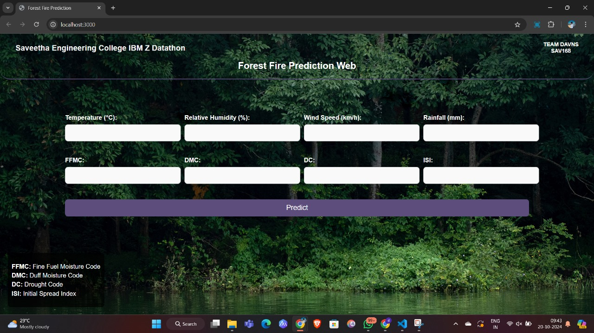

# IBM-FOREST_FIRE_PREDICTION

# TEAM NAME: DAVNS
# TEAM NO:  SAV168

# Aim
he aim of this project is to analyze weather-related variables that impact forest fires and forecast future fire risks based on historical weather data. This project involves merging two datasets, performing data cleaning and preprocessing, and finally using machine learning to predict forest fire risks.

# Abstract
Forest fires pose significant threats to ecosystems, infrastructure, and human life. The key factors influencing forest fire risks include various meteorological conditions such as temperature, humidity, wind speed, and rain. In this project, we analyze these weather parameters to assess their impact on forest fire risks. Two datasets containing historical weather data were merged, cleaned, and analyzed. The project also includes predictive modeling using machine learning algorithms to forecast future fire risks based on the weather conditions. The output includes a merged dataset and predictive results that can be useful for fire risk management and prevention efforts.

# Methodology
Data Preprocessing: The original datasets were cleaned to remove unnecessary columns, and they were merged into a single dataset. Missing values, if any, were handled appropriately.

Exploratory Data Analysis (EDA): Visualization techniques were used to identify trends, correlations, and distributions in the data.

Machine Learning: After preprocessing, a predictive model was developed using machine learning techniques to forecast fire risks based on weather variables.

# Steps Involved
Data Cleaning and Merging: The datasets were cleaned by removing unwanted columns and were merged based on their common weather attributes.

Exploratory Data Analysis: Visualizations such as scatter plots, correlation matrices, and histograms were used to analyze the relationships between the variables.

Model Building: Machine learning models such as Random Forest or Gradient Boosting were implemented to predict fire risks.

Forecasting: The trained models were used to forecast forest fire risks based on new weather data.

# Output and Results
forest_fires Dataset: The two datasets were successfully merged, resulting in a single dataset containing the following columns:

Temperature

Relative Humidity (RH)

Wind Speed (Ws)

Rainfall

FFMC (Fine Fuel Moisture Code)

DMC (Duff Moisture Code)

DC (Drought Code)

ISI (Initial Spread Index)

Predictive Results: After training the machine learning model, predictions for future fire risks were obtained. These results were evaluated based on metrics such as accuracy, precision, recall, and F1-score.

The forecast results demonstrated that certain weather factors like high temperatures, low humidity, and wind speed significantly contribute to the spread of forest fires. Predictive accuracy was satisfactory for real-world fire risk assessment and prevention.

# Conclusion
The project successfully merged and analyzed two weather datasets related to forest fires, providing valuable insights into the impact of meteorological conditions on fire risks. The predictive model developed in this project can be used as a tool for forecasting
future fire risks based on weather data, which could aid in fire management strategies.
